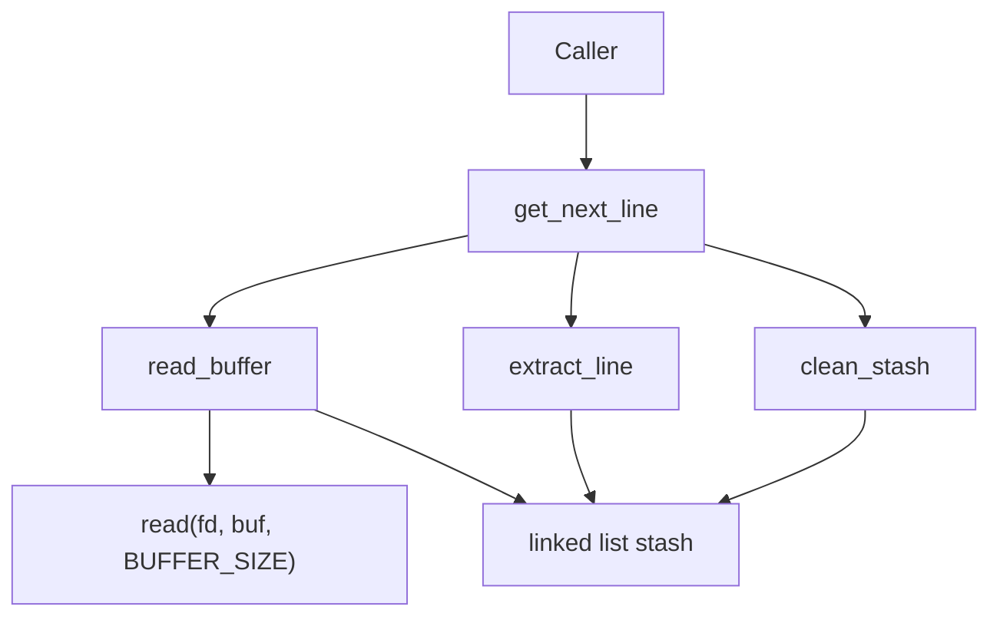
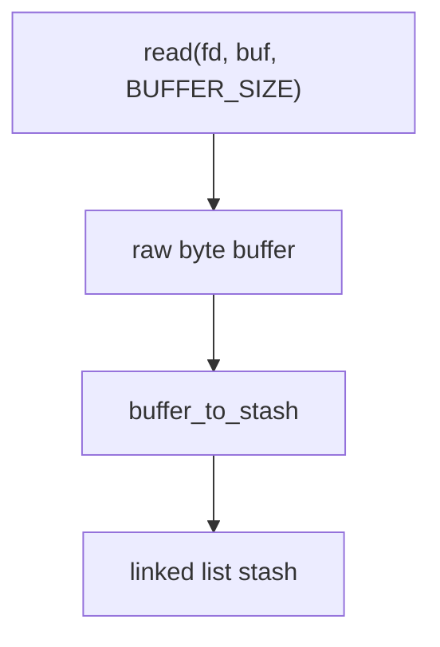

# get_next_line

> A line-oriented file descriptor reader implemented in C using a persistent linked-list buffer and direct POSIX I/O.


---

# Table of Contents

* [Overview](#overview)
* [Design Goals](#design-goals)
* [System Guarantees](#system-guarantees)
* [Architecture](#architecture)
* [Data Flow](#data-flow)
* [Usage](#usage)
* [Performance & Edge Cases](#performance--edge-cases)
* [Engineering Notes](#engineering-notes)
* [License](#license)

---

# Overview

`get_next_line` is a line-oriented reader built directly on top of the POSIX `read(2)` syscall.

Successive calls to the function return **exactly one line per invocation** from a given file descriptor while preserving unread data between calls.

Unlike standard I/O helpers such as `getline` or `fgets`, this implementation:

* performs **no buffered stdio operations**
* manages its own **persistent internal buffer**
* relies on **manual heap management**
* supports **arbitrarily long lines**

The primary challenge is that `read()` retrieves **fixed-size chunks of bytes** that rarely align with newline boundaries.
A single read may contain multiple lines, partial lines, or leftover bytes from the next line.

To solve this, the implementation maintains a **persistent stash** that accumulates bytes across reads and releases them **one line at a time**.

---

# Design Goals

The implementation focuses on demonstrating core systems programming patterns.

| Goal                           | Rationale                                     |
| ------------------------------ | --------------------------------------------- |
| Deterministic memory ownership | Every allocation has a well-defined free path |
| Incremental I/O                | Avoid loading entire files into memory        |
| Unbounded line support         | Lines may exceed the read buffer size         |
| Minimal dependencies           | Only `unistd.h` and `stdlib.h` are required   |
| Predictable API behavior       | Each call returns one logical line            |

---

# System Guarantees

The function maintains several behavioral guarantees that callers can rely on.

### Line Atomicity

Each successful call returns **exactly one logical line**.

A line is defined as:

* a sequence ending in `\n`, or
* the remaining bytes at end-of-file if no newline exists.

---

### Streaming Semantics

Input is consumed **incrementally** from the file descriptor.
The function never reads the entire file into memory.

Memory usage grows **only with the length of the current line**.

---

### Stable State Between Calls

If a read retrieves bytes belonging to multiple lines, the extra bytes remain stored internally and are used by the next call.

This ensures the stream position remains correct across successive invocations.

---

### Buffer Size Independence

Correctness does not depend on the value of `BUFFER_SIZE`.

The implementation behaves correctly for **any value ≥ 1**, including extremely small buffers.

---

### Deterministic Memory Ownership

Returned lines are **heap allocated** and must be freed by the caller.

Internal buffers remain private to the implementation and are cleaned up on error.

---

# Architecture

The implementation is organized around three cooperating components:

1. **Public API**
2. **Stash Engine**
3. **I/O Layer**



---

### Stash Engine

Unread data is stored in a **linked list of read chunks**.


Each node contains the bytes returned from a `read()` call.

This structure allows:

* efficient append operations
* incremental buffer growth
* avoidance of repeated reallocations

---

### I/O Layer

Responsible only for transferring bytes from the kernel.



The I/O layer does not interpret the data.
It simply feeds raw bytes into the stash.

---

# Data Flow

The sequence of operations during a call is:

```mermaid
sequenceDiagram

Caller ->> get_next_line: call
get_next_line ->> stash: check for newline

alt newline present
    stash ->> get_next_line: ready
else read required
    get_next_line ->> read(): syscall
    read() -->> get_next_line: bytes
    get_next_line ->> stash: append
end

get_next_line ->> stash: extract line
get_next_line ->> stash: remove consumed bytes
get_next_line -->> Caller: char *line
```

In practice:

1. The stash is scanned for a newline.
2. If none exists, additional bytes are read from the descriptor.
3. Read data is appended to the stash.
4. Once a newline is detected, the line is assembled.
5. Consumed bytes are removed while leftovers remain for the next call.

---

# Usage

Example program:

```c
#include <fcntl.h>
#include <stdio.h>
#include "get_next_line.h"

int main(void)
{
    int fd;
    char *line;

    fd = open("data.txt", O_RDONLY);

    while ((line = get_next_line(fd)) != NULL)
    {
        printf("%s", line);
        free(line);
    }

    close(fd);
}
```

Reading from standard input:

```c
get_next_line(0);
```

Each returned line must be freed by the caller.

---

# Performance & Edge Cases

### Complexity

| Operation             | Complexity |
| --------------------- | ---------- |
| Reading until newline | O(n)       |
| Line extraction       | O(n)       |

Where `n` is the number of characters before the next newline.

---

### Supported Scenarios

| Scenario                         | Behavior                     |
| -------------------------------- | ---------------------------- |
| Empty file                       | returns `NULL`               |
| File without trailing newline    | final line still returned    |
| Large lines                      | handled through stash growth |
| Small buffer (`BUFFER_SIZE = 1`) | still correct                |
| EOF mid-buffer                   | remaining bytes returned     |

---

# Engineering Notes

- **Static state trade-offs:** Using static storage keeps the API minimal but ties the implementation to a single active stream. Supporting multiple descriptors requires maintaining a stash per descriptor.

- **Syscall granularity:** `BUFFER_SIZE` directly affects performance. Small buffers increase syscall frequency, while larger buffers amortize kernel transitions.

- **Data structure choice:** A linked list avoids expensive buffer reallocations when the stash grows but introduces traversal overhead when extracting lines.

- **Unified cleanup strategy:** All error paths route through a centralized teardown routine, ensuring that internal buffers are fully released before returning `NULL`.

---

## License

This project was completed as part of the 42 School curriculum. It is intended for educational and portfolio purposes.


[Back to top](#printf)